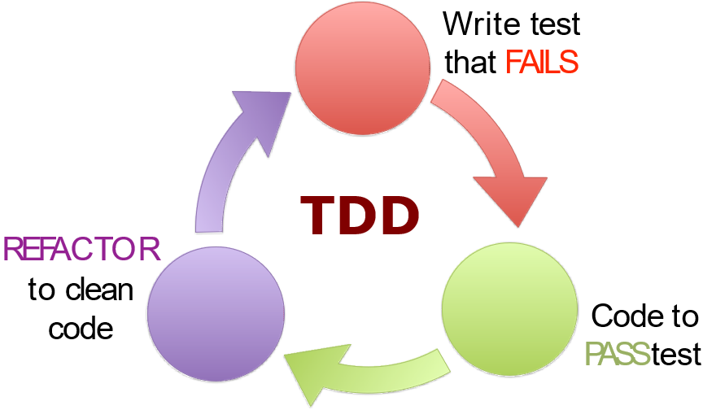
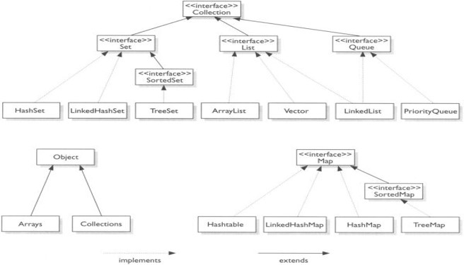
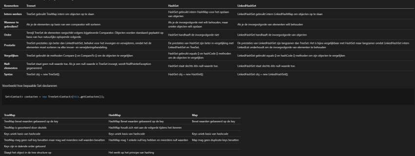

# TDD (Test-Driven Development)



## Testaanpak

1. Maak een javaklasse in de test map met de naam \<naam klasse> + Test
```
    public class <naam klasse>Test {

    }
```
2. Welke methodes moeten worden getest? Public methodes, getters niet (vb. constructor, setters, ...)
    - Normale omstandigheden
    - Abnormale omstandigheden
3. Naamgeving testmethodes: test\<Methode>\_\<Omstandigheid>\_\<Verwacht>\_\<Resultaat>


## Stappen

1. Testmethode schrijven
    - Te testen methode oproepen
    - Resultaat controleren
        - Exception verwacht? (expected = soortException.class)
        - Geen exception verwacht? assert
2. Testmethode laten compileren: lege klasse en methode schrijven
3. Testmethode runnen
4. Testmethode laten slagen
    - Methode aanpassen
    - Test runnen
    - Herhaal tot groen

# Overerving

Voorbeeld: een bank houd meerdere rekeningen bij

## Oplossing 1: 2 lijsten

Twee arraylists: spaarrekening en bankrekening <br>
Probleem: dubbele code

## Oplossing 2: private ArrayList\<Object>

Een lijst in klasse Bank met alle rekeningen &#8594; private ArrayList\<Object> rekeningen

### Klasse Object

Moeder van alle klassen (Bankrekening, Punt, ArrayList, ...) <br>
Alle klassen die je al verzonnen hebt of nog zult verzinnen zijn van het type Object

### Overerving of inheritance

Alle klassen erven over van Object: krijgen automatisch public instantievariabelen en methodes van Object <br>
Object = **superklasse** <br>
Andere klassen = **subklassen**

### Voordeel

Geen dubbele code <br>

### Probleem

Compiler weet dat o tot Object hoort maar weet niet of het bankrekening of spaarrekening is
 - Oplossing: instanceof en typecasting &#8594; dubbele code

Hond is ook object &#8594; zou ook in ArrayList\<Object> kunnen maar mag niet

## Oplossing 3: Maak eigen superklasse en subklassen

### Overerving of inheritance

**Generalisatie**: gemeenschappelijke instantievariabelen en methoden &#8594; afzonderlijke klassen = **superklasse** <br>
**Specialisatie**: specifieke instantievariabelen en methoden &#8594; eigen klasse = **subklasse**

### private - protected

**private** instantievariabelen en methoden kunnen we niet overerven <br>
**protected** instantievariabelen en methoden zijn enkel toegankelijk voor klassen in dezelfde package en subklassen
 - Setters indien nodig protected
 - UML: #

### Voordeel

Makkelijk nieuwe soorten klasse in lijst toevoegen <br>
Je kan enkel klasse toevoegen die je erbij wilt voegen <br>
Geen typecasting nodig om methodes van superklasse op te roepen

## Overriding versus overloading

### Overriding

Methode met **zelfde naam, zelfde returntype en zelfde argumenten** in superklasse en subklasse, maar andere implementatie (vb. format())
```
    public class Bank {
         public String format() {
            String resultaat = "";
            for(Rekening r: rekeningen) {
                resultaat += "\n" + r.format();
                resultaat += "\n-----------------\n";
            }
            return resultaat;
         }
    }
```
```
    public class SpaarRekening extends Bank {
        @Override
        public String format() {
            return super.format() + "\nPercentage: " + this.getPercentage() + "%";
        }
    }
```

### Overloading

Functies met **dezelfde naam** maar **verschillende type of aantal argumenten** (vb. verhoog())
```
    public class Teller {
        public void verhoog(int waarde){
            aantal += waarde;
        }

        public void verhoog(){
            aantal += 10;
        }
    }
```

## Dynamische type versus statisch type

### Statische type

Type van declaratie <br>
Subklasse <br>
Wordt @Compile time gebruikt om te zoen of methode bestaat

### Dynamisch type

Type van gebruikte constructor <br>
Subklassen <br>
Wordt @Runtime gebruikt om te checken welke versie uitgevoerd moet worden

## Typecasting en instanceof

**typecasting**: een parameter Object aan een bepaalde klasse binden <br>
**instanceof**: nagaan tot welke klasse Object o behoord

# Abstracte klassen

Abstracte methoden: wanneer twee subklassen een compleet verschillende implementatie hebben voor dezelfde methode en er dus geen implementatie in de superklasse mogelijk is, maken we de methode in superklasse abstract
```
    public Rechthoek extends Figuur {
        public double getOmtrek() {
            return 2 * (breedte + hoogte);
        }
    }
```
```
    public Cirkel extends Figuur {
        public double getOmtrek() {
            return 2 * Math.PI * straal;
        }
    }
```
```
    public Figuur {
        public abstract double getOmtrek();
    }
```

## Regels voor abstracte klassen

1. Abstracte methodes enkel in abstracte klassen
2. Geen objecten maken van abstracte klassen
3. Elke subklasse moet alle abstracte methodes implementeren, tenzij subklasse zelf abstract is


## Testen Abstracte klassen

Probleem: geen objecten maken van abstracte klassen <br>
Oplossing: kies 1 bestaande, concrete subklasse en test methodes uit de superklasse voor deze subklasse

# Static - Final

## Statische methode

Voorbeeld 1: berekenBMI() levert ander resultaat voor ieder object
 - Resultaat hangt af van instantievariabele
 - Object instantiëren en methode oproepen op object
 - GEEN statische methode

Voorbeeld 2: berekenSom() levert zelfde resultaat voor ieder object
 - Resultaat hangt niet af van instantiewaarden
 - Niet nodig om object te instantiëren
 - Statische methode

Statische methode
 - Hoort niet bij object maar bij klasse
 - Object instantiëren hoeft niet
 - Methode rechtstreeks oproepen op klasse
 - Kan geen instantievariabele aanspreken
 - Kan geen niet-statische methode aanspreken

```
    public class Rekemachine {
        private int getal;

        public static int berekenSom(int getal1, int getal2){
            return getal1 + getal2;
        }

        public static int bereken(int g){
            return getal + g; --> werkt niet!!!!
        }

        public boolean isPositief(int g){...}

        public static int berekenDeling(int getal1, int getal2){
            if(!isPositief(getal2)){...} --> werkt niet!!!!
        }
    }
```
```
    public class AndereKlasse {
        public void eenMethode(){
            int som = Rekenmachine.berekenSom(3, 5);
        }
    }
```

## Statische variabele

Statische variabele
 - Hoort niet bij een object maar bij een klasse 
 - Zelfde waarde voor alle objecten van die klasse

## Juist gebruik

Anti-OO: werkt uitbreidbaarheid tegen, maakt code moeilijker om aan te passen en testen <br>
Gebruik bij
 - Constanten
 - Methodes die objectvelden/-methodes niet nodig hebben
 - Vervang van constructoren

Gebruik niet bij
 - Eigen klassen uitbreiden
 - Niet-final velden

## Final

Toepasbaar op: velden/lokale variabelen/parameters, methodes, klassen <br>

Final variabele: mag niet meer veranderd worden
 - Declaratie in klasse: private final type veldnaam
 - Moet geïnitialiseerd worden in constructor
 - Geen setters mogelijk (validatie in constructor)

Final parameter: mag niet meer veranderd worden
 
Final velden: onwijzigbare objecten
 - Alle velden final
 - Geen setters
 - Gemakkelijker te definiëren en te gebruiken

Final lokale variabelen en parameters
 - Komen minder vaak voor
 - Kan code onleesbaar maken
 - Niet gebruiken zonder goede redenen

Final methode: mag niet overschreven worden (override)
 - Zelden gebruikt
 - Private methodes zijn final
 
Final klasse: mag geen subklasse krijgen
 - Zelden gebruikt
 - Kon om security-gerelateerde overwegingen

## Constante

vb. public stativ final int AANTAL_DAGEN = 7
 - public: mag direct aangesproken worden
 - static: zelfde waarde voor alle objecten
 - final: onwijzigbaar
 - Naamgeving: alles in hoofdletters en woorden onderscheiden met underscore

# Interfaces

```
    public interface Colored {
        Color getColor();
        void setColor(Color c);
    }
```
Alle methodes zijn abstract (keyword niet nodig) <br>
Alle methodes zijn public (keyword niet nodig)

Interface: groep methode signaturen waaraan een naam gegeven is
 - Geen instantievelden
 - Geen implementaties van methodes (abstract)
 - Contract: legt verplichte gedrag op van objecten die interface implementeren, klassen die de interface implementeren moeten alle methode van deze interface hebben (tenzij klasse abstract is), let ook op bij subklassen
 - Gebruik override bij implementatie
 - In UML: <\<interface>>

```
    public class Figuur implements Colored {
        private Color color;

        @Override
        public Color getColor(){
            return color;
        }

        @Override
        public void setColor(Color c){
            this.color = color
        }
    }
```

## Abstracte klasse vs. Interface

| Abstracte klassen | Interfaces |
|-------------------|------------|
| Instantievelden | Aleen public static final velden = constanten |
| Constructors | Geen constructor |
| Sommige methodes abstract | Alle methodes abstract |
| Klasse kan maar van 1 klasse extenden | Klasse kan meerdere interfaces implementeren |
| public, private of protected | alles public |


## Losse koppeling

Niet nodig om eigen klassen te kenne = OPEN CLOSED principe (vb. List\<Movable> movables) <br>
Gebruik waar mogelijk een interface/superklasse als statische type

Probleem: methode niet in interface wel in klasse

### Oplossing 1: Niet open closed

private List\<Car> movables

### Oplossing 2: Methode toevoegen aan interface

Alle andere klassen moeten ook aangepast worden &#8594; NIET open closed

### Oplossing 3: default methodes

"Add new functionalities to interfaces without breaking classes that implement that interface" <br>
Andere klassen moeten niet aangepast worden

## Interface en overerving

Interface kan overerven van andere interface

## Interface in testing

Methodes van interface hebben geen implementatie dus we kunnen ze niet testen

## Interfaces in Java

### Cloneable

Wanneer een klasse Cloneable implementeert mag de clone() metode gebruikt worden.
```
    public Fiets clone() throw CloneNotSupportedException {
        return (Fiets)super.clone();
    }
```

### Serializable

Wanneer een klasse Serializable implementeert, kunnen de objecten geserialiseerd worden <br>
Transient: zorgt ervoor dat instantievariabele niet geserialiseerd wordt
 - Is oorspronkelijk waarde verloren na deserializeren
 - Krijgt instantievariabele default waarde

```
    public class Database {
        public void addWiel(Wiel wiel) throws Exception {
            FileOutputStream fs = new FileOutputStream("Wiel.txt");
            ObjectOutputStream os = new ObjectOutputStream(fs);
            os.writeObject(wiel);
            os.close
        }

        public Wiel getWiel() throws Exception {
            FileInputStream fs = new FileInputStream("Wiel.txt");
            ObjectInputStream os = new ObjectInputStream(fs);
            Wiel wiel = (Wiel) os.readObject();
            os.close;
            return wiel
        }
    }
```

# Exceptions

## Exceptions maken en opgooien: throw

Exception is een object dat informatie geeft over een probleem/exceptionele situatie <br>
Eerst wordt het exception object aangemaakt om aan te geven dat er een probleem is ontstaan, dan wordt het exception object opgegooid <br>
exceptionObject.getMessage() geeft boodschap terug

## Exceptions afhandelen

1. Methode signaleert dat een exceptionele situatie is opgetreden &#8594; exception gegooid
2. Uitvoering van code die exception gooit stopt
3. OF de opgegooirde exception wordt nergens afgehandeld &#8594; uitvoering programma stopt <br>
   OF er is code die deze exceptionele situatie behandelt &#8594; exception wordt afgehandeld

### try - catch

Een exception handler bewaakt statements waarin exceptions kunnen opgegooid worden
```
    try {
        // code die een exception kan opgooien
    } catch (ExceptionType e) {
        // code om exception van ExceptionType af te handelen
    }
```
Wanneer een exception wordt opgegooird, wordt uitvoering van de code in try gestopt en gaat men verder met catch

### finally

In een finally block staan statements die uitgevoerd worden nadat de try-catch processing voorbij is (treedt dus altijd op) <br>
```
    try {
        // code die een exception kan opgooien
    } catch (ExceptionType e) {
        // code om exception van ExceptionType af te handelen
    } finally {
        // code die altijd uitgevoerd wordt
    }
```

## Exception klassen

### Checked versus unchecked exceptions

#### Unchecked

**Error** en subklassen: fouten die
 - Buiten de applicatie liggen
 - Meestal niet kunnen geanticipeerd worden door applicatie
 - Waarvan applicatie meestal niet kan herstellen

**RuntimeException** en subklassen: fouten die
 - Binnen de applicatie liggen
 - Gevolg van programmeerfout
 - Niet kunnen geanticipeerd worden door applicatie
 - Applicatie kan niet herstellen
 - Gefixt worden in plaats van opvangen

#### Checked

**Exception** en subklassen: fouten die
 - Buiten de controle van de developer vallen
 - Geanticipeerd moeten worden door applicatie
 - Gecheckt worden door compiler
 - Waarvan applicatie moet kunnen herstellen

Compiler
 - Checkt of exception gegooid kan worden
 - Waarschuwt als dit het geval is
 - Als developer rekening mee houden

### catch or declare regel voor checked exceptions

Als methode een checked exception zou kunnen opgooien moet deze exception
 - Ofwel gedeclareerd worden in hoofding van methode: throws
 - Ofwel afgehandeld worden in methode: try - catch

### Eigen exception klassen

Maak je eigen exception klassen om te differentiëren en exceptions te situeren <br>
Maak subklasse van RuntimeException &#8594; unchecked exception
```
    class DomainException extends RuntimeException {
        public DomainException(String message) {
            super(message);
        }
    }
```

## UML en exceptions

Exception class: <\<exception>> <br>
Methode die exception opgooit: + methodeNaam(): throws ExceptionType

# List

## Tekstbestanden

Alle gegevens in parameters en variabelen is tijdelijk <br>
We willen
 - van ArrayList van objecten informatie wegschrijven naar een bestand &#8594; creëren bestand
 - Informatie van bestand overbrengen naar ArrayList van objecten

### Bestand creëren

We gebruiken: [File](https://docs.oracle.com/javase/8/docs/api/java/io/File.html) & [PrintWriter](https://docs.oracle.com/javase/8/docs/api/java/io/PrintWriter.html)

```
    public class PrintWriterSimpleExample {
        public static void main(String[] args){
            ArrayList<String> lijst = new ArrayList<>();
            lijst.add("Mieke");
            lijst.add("Elke");

            File namen = new File("Namen.txt");

            try {
                PrintWriter writer = new PrintWriter(namen);
                for(String s: lijst){
                    writer.println(s);
                }
                writer.close();
            } catch (FileNotFoundException e){
                throw new DomainException("Fout bij het wegschrijven", e);
            }
        }
    }
```

### Van bestand naar ArrayList van objecten

Gegeven:
 - Klasse Persoon
    - Instantievariabelen: String naam, voornaam
    - Constructor naam, voornaam
    - Getters/setters

 - Tekstbestand met *N* lijnen, elke lijn voornaam/naam

```
    public class ScannerPersoonExample {
        public static void main(String[] args){
            ArrayList<Persoon> personen = new ArrayList<>();
            File personenFile = new File("Personen.txt");

            try {
                Scanner scannerFile = new Scanner(personenFile);
                while(scannerFile.hasNextLine()){
                    String s = scannerFile.nextLine();
                    String[] delen = s.split("/");
                    Persoon persoon = new Persoon(delen[1], delen[0]);
                    personen.add(persoon);
                }
            } catch (FileNotFoundException e){
                throw new DomainException("Fout bij het inlezen", e);
            }
        }
    }
```

## ArrayList revisited

### Array vs ArrayList

### Array

Statische rij
 - Lengte bepaald bij aanmaken
 - Kan niet groter of kleiner worden

vb. int[] getallen = new int[100]

### ArrayList

Dynamische rij
 - Lengte initieel 0
 - Groter bij toevoegen, kleiner bij verwijderen

Declaratie: ArrayList\<T> lijst
Initialisatie: lijst = new ArrayList<>();

Voordelen
 - indexOf: methode om positief van gegeven string op te vragen (niet in lijst? return - 1)
 - contains: methode om na te gaan of gegeven string in lijst voorkomt
 - remove: methode om eerste voorkomen van gegeven String te verwijderen uit lijst

### For versus Foreach

For in een array
```
    for int(i = 0; i < getallen.length; i++){
        System.out.println(getallen[i]);
    }
```
For in ArrayList
```
    for(int i = 0; i < studenten.size(); i++){
        System.out.println(studenten.ge(i).getNaam());
    }
```
Foreach in array
```
    for(int getal: getallen){
        System.out.println(getal);
    }
```
Foreach in ArrayList
```
    for(Persoon p: studenten){
        System.out.println(p.getNaam());
    }
```
Foreach overloopt **ALLE** elementen van je array of ArrayList

## JCF

Java Collections Framework = aantal klassen en interfaces &#8594; datastructuren om collecties van objecten bij te houden



### Collection

add, addAll, clear, contains, containsAll, isEmpty, iterator, remove, removeAll, size, toArray, sort

### List

Elementen worden in volgorde bijgehouden, volgnummer 0 tot an met size() - 1 <br>
Opmerkingen
 1. add(e) in volgorde ingave, achteraan toevoegen
 2. add &#8594; dubbels toegelaten, geeft altijd true terug
 3. add &#8594; null toegelaten, geeft altijd true terug
 4. indexOutOfBoundException mogelijk

add, get, indexOf, lastIndexOf, remove, set, sort, subList

### ArrayList

Interne implementatie door middel an statische rij met initiële capaciteit 10 of meegeven
 - ArrayList<>()
 - ArrayList<>(initCap: int)
 - ArrayList<>(coll: Collection\<E>)
 - Opzoeken/wijzigen: snel
 - Toevoegen/verwijderen: vooraan traag

### LinkedList

LinkedList houdt pointer naar eerste element bij, elk element houdt pointer naar volgend element bij
 - LinkedList<>()
 - LinkedList<>(coll: Collection\<E>)
 - Opzoeken/wijzigen: traag
 - Toevoegen vooraan/weglaten: snel

Deque = double ended queue
 - Vooraan verwijderen &#8594; pollFirst():E
 - Actheraan verwijderen &#8594; pollLast(): E
 - Vooraan toevoegen &#8594; offerFirst(e)
 - Achteraan toevoegen &#8594; offerLast(e)
 - Vooraan inspecteren &#8594; peekFirst(): E
 - Achteraan inspecteren &#8594; peekLast(): E

# Set en Map

## Set

add, addAll <br>
Toevoegen: geen dubbels &#8594; geeft false terug <br>
HashSet: interne implementatie door middel van HashMap <br>
LinkedHashSet: volgorde van ingave, werkt met LinkedHashMap

## Map

Doel: elementen snel opzoeken kan in statische array op voorwaarde dat je index kent, nadeel is dat je enkel via gehele getallen kan zoeken <br>
Map\<K,V> = Verzameling key-value paren waarbij er maar 1 paar is met specifieke waarde voor key
 - Maakt het mogelijk zeer snel informatie op te zoeken op basis van een key
 - Key is object van klasse K, value is object van klasse V
 - Key-value paar wordt ook entry genoemd

Werkwijze
 - Array of ArrayList &#8594; opzoeken door index
 - Opzoeken aan de hand van iets anders dan index &#8594; logische sleutel
 - Oplossing: functie met logische sleutel omzetten naar index &#8594; methode hashCode()

HashMap: array van Entries &#8594; aantal elementen bepaald bij constructor (buckets)
HashCode: getal dat wordt berekend op basis van informatie uit de key &#8594; bepaalt plaats in array waar key-value paar terecht komt (index)
Hashfunctie: berekent hashCode op basis van informatie uit key en wordt gebruikt door methodes die entries toevoegen, opvragen, wijzigen, ...

### Collision

hashCode(): int in klasse K is geen injectieve functie = twee verschillende objecten kunnen afgebeeld worden op dezelfde waarde <br>
In een array komen alle entries waarvan key door hashCode afgebeeld op zelfde waarde terecht in LinkedList

### Zoek in hashMap op basis key k

1. Bereken k.hashCode() % #buckets
2. Loop LinkedList af tot equals true &#8594; trager hoe meer entries per bucket

### Load-factor

Loadfactor of bezettingsgraad = #entries / #buckets
 - 0 = tabel leeg
 - 1 = evenveel entries als buckets
 - 3 = gemiddeld 3 entries in een bucket
 - Als bezettingsgraad stijgt zal performantie dalen. Vanaf 0.75 sterk dalen.
 - Rehash: aantal buckets verdubbelen en entries herverdelen over beschikbare buckets

### Equals

Reflexief: x.equals(x) altijd true <br>
Symmetrisch: als x.equals(y) dan y.equals(x) <br>
Transitief: als x.equals(y) en y.equals(z) dan x.equals(z) <br>
x.equals(y) altijd zelfde resultaat <br>
x.equals(null) altijd false

### hashCode

x.hashCode() altijd zelfde resultaat <br>
x.equals(y) dan x.hashCode() == y.hashCode <br>
x.hashCode == y.hashCode betekent niet x.equals(y)

### multiMap

beeldt key af op collection van value paren (vb. username en al gebruikte paswoorden)

### TreeMap

Keys worden gesorteerd bijgehouden in boomstructuur <br>
Gevolg voor klasse K:
 - Implements Comparable-interface
 - Of comperator meegeven

# Iterator

for each loop om te itereren over een ArrayList:
 - Probleem wanneer je tijdens itereren één of meerdere elementen wil verwijderen
 - ConcurrentModificationException
 - GEBRUIK ITERATOR

```
    public class voorbeeld {
        List<String> strings = new ArrayList<>();
        string.add("de");
        string.add("man");
        string.add("met");
        string.add("de");
        string.add("pet");

        Iterator<String> stringsIterator = strings.iterator();
        while(stringIterator.hasNext()){
            String woord = stringIterator.next();
            if(woord.equals("de")){
                stringsIterator.remove
            }
        }

        System.out.println(strings)
    }
```

## equals() en compareTo()

```
    public class User {
        private String name;
        private int age;
        private String passport;

        public boolean equals(Object o){
            if(!(o instanceof User)){
                return false;
            }
            User user = (User)o;
            return age == user.age && Objects.equals(name, user.name) && Objects.equals(passport, user.passport);
        }

        public int hashCode(){
            return Objects.hash(name, age, passport);
        }
    }
```
```
    public class User {
        private String name;
        private int age;
        private String passport;

        public boolean equals(Object o){
            if(!(o instanceof User)){
                return false;
            }
            User user = (User)o;
            return age == user.age && Objects.equals(name, user.name) && Objects.equals(passport, user.passport);
        }

        public int compareTo(User o){
            int difference = age - o.age;

            if(difference == 0){
                difference = name.compareTo(o.name);

                if(difference == 0){
                    difference = passport.compareTo(o.passport);
                }
            }

            return difference;
        }
    }
```